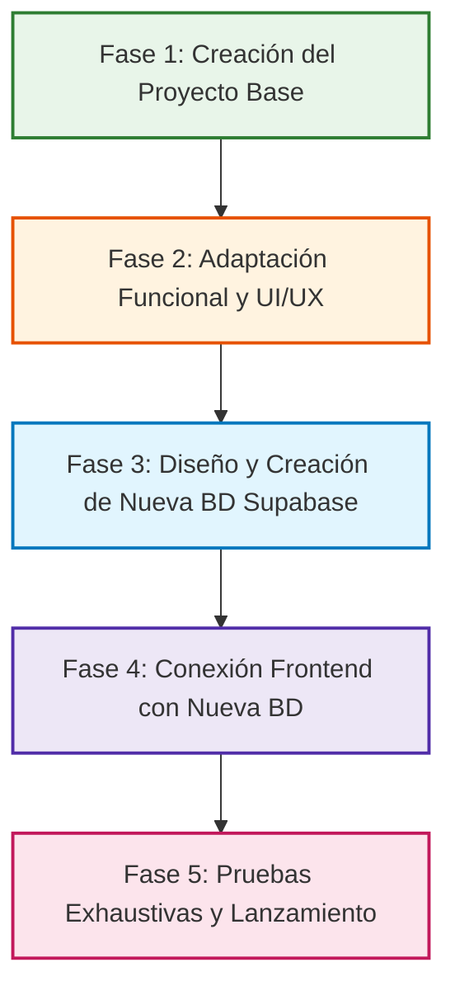

# Planificación General del Proyecto: Gestión Ganadera

Este documento define la hoja de ruta estratégica, el desglose de fases, las decisiones técnicas y el estado de avance para el desarrollo del nuevo sistema **Gestión Ganadera**, tomando como punto de partida y base arquitectónica el sistema **`App-ganadera-v2`**.

---

## 📌 Resumen del Proyecto

- **Nombre del Proyecto**: Gestión Ganadera (`gestion-ganadera`)
- **Base de Origen**: `App-ganadera-v2` (React 19 + Vite 8 + Dexie 4 + Tailwind CSS v4 + Supabase)
- **Paradigma**: Progressive Web App (PWA) Offline-First para campo y zonas rurales sin conectividad
- **Objetivo**: Desarrollar una nueva versión especializada que mantenga la robustez de sincronización y usabilidad offline de la base, adaptando y evolucionando los flujos, pantallas, modelos de datos y características hacia las nuevas especificaciones de negocio.

---

## 🗺️ Mapa de Fases de Desarrollo

---

## 📋 Detalle de Fases y Estado de Avance

### ✅ Fase 1: Creación del Proyecto Base
> **Objetivo**: Duplicar y aislar la base operativa de `App-ganadera-v2` en el nuevo directorio `gestion-ganadera`, asegurando paridad funcional 100%, compilación impecable y conexión provisional a la base de datos existente.

- [x] Estructuración del directorio raíz `C:\Users\joses\appganadera\gestion-ganadera`.
- [x] Copia íntegra de componentes, páginas, utilidades, esquemas y recursos estáticos (`src/`, `public/`).
- [x] Configuración del entorno de dependencias y `node_modules` optimizado para React 19 y Vite 8.
- [x] Actualización de identificadores en `package.json` (`name: "gestion-ganadera"`).
- [x] Configuración de metadatos PWA y manifiesto en `vite.config.js` e `index.html` ("Gestión Ganadera").
- [x] Configuración de variables de entorno `.env.local` con credenciales de Supabase actual para asegurar continuidad durante el desarrollo.
- [x] Verificación de compilación exitosa (`npm run build` ejecutado en 861ms generando Service Worker PWA).
- [x] Creación de `planificacion.md` y `CHANGELOG.md` para control formal del ciclo de vida.
- [x] Vinculación y sincronización con el repositorio remoto de GitHub (`https://github.com/JorgeM11/Gesti-n_Ganadera.git`) en rama `main`.

---

### 🔄 Fase 2: Adaptación Funcional y Rediseño Frontend
> **Objetivo**: Modificar los flujos, formularios, vistas y componentes para remover las características innecesarias y añadir las nuevas funciones requeridas por el usuario.

- [x] **Eliminaciones y Simplificaciones Solicitadas**:
  - [x] **Reproducción**: Removidos los sub-módulos de Tactos (Palpación) y Servicios reproductivos. La pestaña `ReproductionTab.jsx` se simplificó para mostrar exclusivamente Partos/Crías (`PartosTab.jsx`).
  - [x] **Ordeño**: Removido por completo de todo el sistema en interfaz (pestaña en perfil de animal, botones de registro rápido en tarjetas, acceso en drawer de navegación lateral, rutas y modales).
  - [x] **Vacunación por Lotes y Botón Flotante (`+`)**: Removido el modo por lotes y su menú contextual. El botón `+` en `Inventario.jsx` ahora navega directamente a `/inventario/nuevo`.
  - [x] **Formulario Animal (`AnimalForm.jsx`)**: Removido el acordeón de servicio de origen y la consulta de servicios de la madre.
  - [x] **Detalle del Animal (`DetailsTab.jsx`)**: Removida la tarjeta de servicio de origen.
  - [x] **Formulario de Salud (`HealthForm.jsx`)**: Simplificado para registrar tratamientos sanitarios individuales sin lógica de lotes.
  - [x] **Limpieza de Rutas y Archivos Obsoletos**:
    - Eliminadas rutas `/inventario/perfil/servicio`, `/inventario/perfil/tacto` y `/inventario/tratamiento-lote` en `App.jsx`.
    - Eliminados archivos de componentes y páginas huérfanos: `MilkingTab.jsx`, `MilkingModal.jsx`, `TactosTab.jsx`, `ServiciosTab.jsx`, `TactoForm.jsx`, `ServicioForm.jsx`, `PerfilTacto.jsx`, `PerfilServicio.jsx`, `TratamientoLote.jsx`.
- [x] **Nuevas Características Incorporadas**:
  - [x] **Potreros (Segundo nivel de Finca)**:
    - Entidad `potreros` asociada a `farm_id` en IndexedDB ([`db.js`](file:///C:/Users/joses/appganadera/gestion-ganadera/src/lib/db.js) y [`potreroUtils.js`](file:///C:/Users/joses/appganadera/gestion-ganadera/src/lib/potreroUtils.js)).
    - **Modal Independiente de Potreros ([`PotreroModal.jsx`](file:///C:/Users/joses/appganadera/gestion-ganadera/src/components/inventario/PotreroModal.jsx))**: Gestión autónoma idéntica a Fincas y Dueños, con validación estricta y obligatoria de **Nombre del Potrero** y **Finca Asociada**.
    - Integración de acceso a Potreros en la barra lateral ([`NavigationDrawer.jsx`](file:///C:/Users/joses/appganadera/gestion-ganadera/src/components/inventario/NavigationDrawer.jsx)), [`Inventario.jsx`](file:///C:/Users/joses/appganadera/gestion-ganadera/src/pages/Inventario.jsx) y [`AnimalForm.jsx`](file:///C:/Users/joses/appganadera/gestion-ganadera/src/components/inventario/AnimalForm.jsx).
    - Filtro por potrero en [`Inventario.jsx`](file:///C:/Users/joses/appganadera/gestion-ganadera/src/pages/Inventario.jsx) con sub-filtro condicional al seleccionar una finca.
  - [x] **Dueños (Propietarios)**:
    - Entidad `owners` en IndexedDB ([`db.js`](file:///C:/Users/joses/appganadera/gestion-ganadera/src/lib/db.js) y [`ownerUtils.js`](file:///C:/Users/joses/appganadera/gestion-ganadera/src/lib/ownerUtils.js)).
    - Modal de gestión de dueños [`OwnerModal.jsx`](file:///C:/Users/joses/appganadera/gestion-ganadera/src/components/inventario/OwnerModal.jsx) y acceso desde el menú lateral ([`NavigationDrawer.jsx`](file:///C:/Users/joses/appganadera/gestion-ganadera/src/components/inventario/NavigationDrawer.jsx)).
    - Selector y creación rápida de dueños desde [`AnimalForm.jsx`](file:///C:/Users/joses/appganadera/gestion-ganadera/src/components/inventario/AnimalForm.jsx).
    - Búsqueda y visualización por dueño en tarjetas de inventario y detalle del perfil.
  - [x] **Reestructuración de Formulario Animal ([`AnimalForm.jsx`](file:///C:/Users/joses/appganadera/gestion-ganadera/src/components/inventario/AnimalForm.jsx))**:
    - Orden estricto según especificación: 1. Arete, 2. Chip, 3. Nombre, 4. Género, 5. Fecha nacimiento, 6. Peso, 7. Color, 8. Dueño, 9. Finca, 10. Potrero (habilitado al escoger finca), 11. Madre y Padre, 12. Raza sin porcentaje (incluye "Sin raza"), 13. Activo o Inactivo, 14. Foto + Descripción.
    - Desactivación de autocompletado del navegador (`autoComplete="off"`) en los 3 primeros inputs (arete, chip y nombre).
    - Acordeones de eventos de nacimiento y destete removidos por completo.
    - Barra de porcentaje y cálculos genéticos de pureza removidos del formulario.
  - [x] **Ajustes y Correcciones Visuales/Funcionales**:
    - [x] **Modal de Fincas y Potreros (`FarmModal.jsx`)**: Botón de administración de potreros reubicado debajo de la información principal de la finca.
    - [x] **Botones de Guardar y Cancelar Fijos y Simétricos (`AnimalForm.jsx`, `BottomSheet.jsx`)**: Fijados al borde inferior sin márgenes sobrantes y con tamaño equilibrado 50%/50% (`flex-1`).
    - [x] **Generación de Evento de Nacimiento (`AnimalForm.jsx`)**: Sincronización automática de fecha y peso de nacimiento a la tabla `growth_events` con tipo `'Nacimiento'`.
    - [x] **Botón de Editar Perfil en Vista Móvil (`DetailsTab.jsx`)**: Botón flotante animado (FAB) en la esquina inferior derecha idéntico a `EvolutionTab` y `HealthTab`.
    - [x] **Modales Más Anchos en Laptop (`BottomSheet.jsx`, `NuevoAnimal.jsx`, `PerfilAnimal.jsx`)**: Ancho expandido a `max-w-4xl lg:max-w-5xl` tanto para edición principal como para modales recursivos de Padre y Madre.
    - [x] **Llamado de Atención en Sincronización (`SyncStatus.jsx`)**: Animación de pulso/respiración (crece y se disminuye) cuando hay pendientes de sincronizar.
    - [x] **Icono de Vaca en Menú Lateral (`NavigationDrawer.jsx`)**: Sustituido el escudo por la silueta de vaca (`GiCow`).
    - [x] **Eliminación Restringida**: Eliminada la opción de borrado para Dueños, Potreros y Fincas.
    - [x] **Cards de Animales en 2 Columnas para Móvil (`Inventario.jsx`)**: Cuadrícula `grid-cols-2` fija en teléfonos móviles con diseño y tipografía optimizados.
  - [x] **Filtros Avanzados y Búsqueda en Inventario ([`Inventario.jsx`](file:///C:/Users/joses/appganadera/gestion-ganadera/src/pages/Inventario.jsx))**:
    - [x] **Filtro Contextual por Potrero**: En el drawer de filtros, la sección de potreros se activa dinámicamente tras seleccionar una finca, mostrando el conteo de animales por potrero. Si no hay finca elegida, guía al usuario a seleccionar una con un icono SVG `Info` (sin emojis).
    - [x] **Filtro por Dueño**: Sección dedicada en el drawer de filtros que permite filtrar animales por propietario específico, sin dueño asignado o todos.
    - [x] **Búsqueda por Chip Electrónico**: Barra de búsqueda optimizada para consultar por chip (`chip_number`), arete (`number`), nombre (`name`) y dueño (`owner`), normalizando caracteres y espacios.
    - [x] **Banner Interactivo de Filtros Activos**: Tags removibles visibles arriba de la lista para remover filtros individuales (Finca, Potrero, Dueño, Sexo, Estado, etc.) o limpiar todos con un clic.
  - [x] **Actualización de Ficha Técnica ([`DetailsTab.jsx`](file:///C:/Users/joses/appganadera/gestion-ganadera/src/components/DetailsTab.jsx)) e Inventario ([`Inventario.jsx`](file:///C:/Users/joses/appganadera/gestion-ganadera/src/pages/Inventario.jsx))**:
    - Visualización limpia de arete, chip, nombre, dueño, finca, potrero, raza sin porcentaje y estado.

---

### ⏳ Fase 3: Diseño y Despliegue de Nueva BD en Supabase
> **Objetivo**: Crear y aprovisionar un nuevo proyecto/esquema en Supabase que tome como base la estructura original y añada todas las tablas, columnas, restricciones e índices demandados por el nuevo frontend.

- [ ] Creación del nuevo proyecto en Supabase Cloud.
- [ ] Extracción y análisis del DDL de la base de datos anterior.
- [ ] Modificación y creación de scripts SQL de migración (nuevas tablas, campos, llaves foráneas).
- [ ] Configuración de buckets de almacenamiento para fotos (`gestion_images`).
- [ ] Políticas de seguridad Row Level Security (RLS) y roles de usuario.
- [ ] Actualización del esquema local Dexie (`src/lib/db.js`) para alinear versiones y migraciones.

---

### ⏳ Fase 4: Conexión Frontend con la Nueva BD
> **Objetivo**: Enlazar la aplicación con la nueva instancia de Supabase y validar la comunicación de ida y vuelta.

- [ ] Actualización de variables de entorno `.env.local` con las nuevas URL y Anon Key.
- [ ] Ajustes en `supabaseClient.js`, `syncUtils.js` y `authService.js` según nuevos esquemas.
- [ ] Validación de la cola de sincronización (`sync_queue`) con los nuevos endpoints y tablas.
- [ ] Pruebas de autenticación y seed del primer administrador en la nueva BD.

---

### ⏳ Fase 5: Pruebas Exhaustivas y Aseguramiento de Calidad
> **Objetivo**: Certificar la estabilidad, rendimiento y resiliencia del sistema bajo condiciones extremas de campo.

- [ ] Pruebas de funcionamiento Offline estricto (modo avión, desconexión de red, reinicio de navegador sin red).
- [ ] Pruebas de sincronización bidireccional y resolución de conflictos al restablecer conexión.
- [ ] Pruebas de compresión y subida de imágenes fotográficas en redes de baja velocidad.
- [ ] Verificación de responsive design en móviles (iOS / Android) y monitores de escritorio.
- [ ] Auditoría de Lighthouse para PWA (instalabilidad, Service Worker, carga inmediata).
- [ ] Cierre y entrega formal del sistema.

---

## 📈 Bitácora de Estado Actual

| Hito | Fecha | Estado | Responsable | Observaciones |
| :--- | :---: | :---: | :---: | :--- |
| **Puesta en marcha Fase 1** | 2026-10-02 | **Completado** | Antigravity AI | Proyecto `gestion-ganadera` creado y compilando al 100% sobre la base de `App-ganadera-v2`. |
| **Fase 2: Eliminaciones solicitadas** | 2026-10-02 | **Completado** | Antigravity AI | Retirado ordeño, tactos, servicios reproductivos, modo lotes en vacunación y botón `+` directo. Compilación verificada con éxito. |
| **Fase 2: Nuevas funcionalidades frontend** | 2026-10-02 | **Completado** | Antigravity AI | Implementados Potreros por Finca, Dueños, nuevo orden en AnimalForm (arete, chip, nombre, género, nacimiento, peso, color, dueño, finca, potrero, padres, raza sin %, activo/inactivo, foto + desc) y filtros. |
| **Pase a Fase 3: Nueva BD Supabase** | Pendiente | *Por iniciar* | Antigravity AI & Usuario | Listo para diseñar la nueva estructura de base de datos en Supabase con potreros, dueños, y nuevos campos. |

