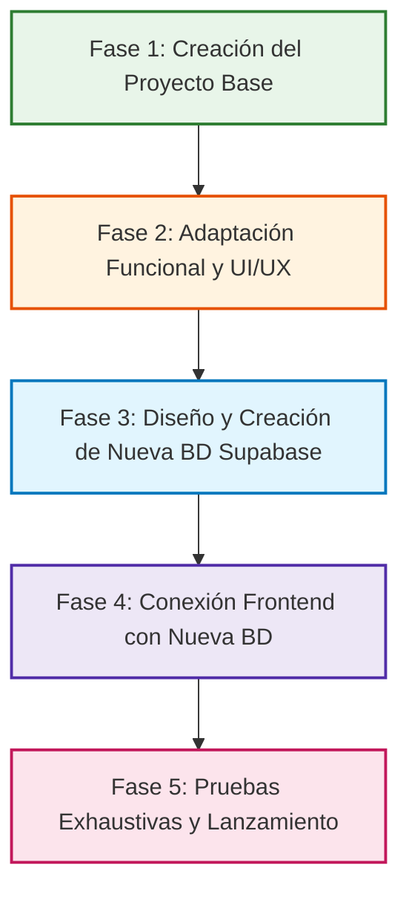

# Planificación General del Proyecto: Gestión Ganadera

Este documento define la hoja de ruta estratégica, el desglose de fases, las decisiones técnicas y el estado de avance para el desarrollo del nuevo sistema **Gestión Ganadera**, tomando como punto de partida y base arquitectónica el sistema **`App-ganadera-v2`**.

---

## 📌 Resumen del Proyecto

- **Nombre del Proyecto**: Gestión Ganadera (`gestion-ganadera`)
- **Base de Origen**: `App-ganadera-v2` (React 19 + Vite 8 + Dexie 4 + Tailwind CSS v4 + Supabase)
- **Paradigma**: Progressive Web App (PWA) Offline-First para campo y zonas rurales sin conectividad
- **Objetivo**: Desarrollar una nueva versión especializada que mantenga la robustez de sincronización y usabilidad offline de la base, adaptando y evolucionando los flujos, pantallas, modelos de datos y características hacia las nuevas especificaciones de negocio.

---

## 🗺️ Mapa de Fases de Desarrollo

---

## 📋 Detalle de Fases y Estado de Avance

### ✅ Fase 1: Creación del Proyecto Base
> **Objetivo**: Duplicar y aislar la base operativa de `App-ganadera-v2` en el nuevo directorio `gestion-ganadera`, asegurando paridad funcional 100%, compilación impecable y conexión provisional a la base de datos existente.

- [x] Estructuración del directorio raíz `C:\Users\joses\appganadera\gestion-ganadera`.
- [x] Copia íntegra de componentes, páginas, utilidades, esquemas y recursos estáticos (`src/`, `public/`).
- [x] Configuración del entorno de dependencias y `node_modules` optimizado para React 19 y Vite 8.
- [x] Actualización de identificadores en `package.json` (`name: "gestion-ganadera"`).
- [x] Configuración de metadatos PWA y manifiesto en `vite.config.js` e `index.html` ("Gestión Ganadera").
- [x] Configuración de variables de entorno `.env.local` con credenciales de Supabase actual para asegurar continuidad durante el desarrollo.
- [x] Verificación de compilación exitosa (`npm run build` ejecutado en 861ms generando Service Worker PWA).
- [x] Creación de `planificacion.md` y `CHANGELOG.md` para control formal del ciclo de vida.
- [x] Vinculación y sincronización con el repositorio remoto de GitHub (`https://github.com/JorgeM11/Gesti-n_Ganadera.git`) en rama `main`.

---

### ⏳ Fase 2: Adaptación Funcional y Rediseño Frontend
> **Objetivo**: Modificar los flujos, formularios, vistas y componentes para remover las características innecesarias y añadir las nuevas funciones requeridas por el usuario.

- [ ] Definición del inventario de cambios:
  - Listado de módulos/campos a **eliminar**.
  - Listado de nuevos módulos/campos a **incorporar**.
- [ ] Ajustes en navegación global, rutas en `src/App.jsx` y menú lateral `NavigationDrawer.jsx`.
- [ ] Modificación de componentes y pantallas de catálogo (`Inventario.jsx`).
- [ ] Actualización de formularios maestros (`AnimalForm.jsx`, `EventForm.jsx`, etc.).
- [ ] Adaptación de vistas de detalle y fichas (`PerfilAnimal.jsx` y sus pestañas).
- [ ] Ajuste de esquemas de validación Zod y hooks de estado.

---

### ⏳ Fase 3: Diseño y Despliegue de Nueva BD en Supabase
> **Objetivo**: Crear y aprovisionar un nuevo proyecto/esquema en Supabase que tome como base la estructura original y añada todas las tablas, columnas, restricciones e índices demandados por el nuevo frontend.

- [ ] Creación del nuevo proyecto en Supabase Cloud.
- [ ] Extracción y análisis del DDL de la base de datos anterior.
- [ ] Modificación y creación de scripts SQL de migración (nuevas tablas, campos, llaves foráneas).
- [ ] Configuración de buckets de almacenamiento para fotos (`gestion_images`).
- [ ] Políticas de seguridad Row Level Security (RLS) y roles de usuario.
- [ ] Actualización del esquema local Dexie (`src/lib/db.js`) para alinear versiones y migraciones.

---

### ⏳ Fase 4: Conexión Frontend con la Nueva BD
> **Objetivo**: Enlazar la aplicación con la nueva instancia de Supabase y validar la comunicación de ida y vuelta.

- [ ] Actualización de variables de entorno `.env.local` con las nuevas URL y Anon Key.
- [ ] Ajustes en `supabaseClient.js`, `syncUtils.js` y `authService.js` según nuevos esquemas.
- [ ] Validación de la cola de sincronización (`sync_queue`) con los nuevos endpoints y tablas.
- [ ] Pruebas de autenticación y seed del primer administrador en la nueva BD.

---

### ⏳ Fase 5: Pruebas Exhaustivas y Aseguramiento de Calidad
> **Objetivo**: Certificar la estabilidad, rendimiento y resiliencia del sistema bajo condiciones extremas de campo.

- [ ] Pruebas de funcionamiento Offline estricto (modo avión, desconexión de red, reinicio de navegador sin red).
- [ ] Pruebas de sincronización bidireccional y resolución de conflictos al restablecer conexión.
- [ ] Pruebas de compresión y subida de imágenes fotográficas en redes de baja velocidad.
- [ ] Verificación de responsive design en móviles (iOS / Android) y monitores de escritorio.
- [ ] Auditoría de Lighthouse para PWA (instalabilidad, Service Worker, carga inmediata).
- [ ] Cierre y entrega formal del sistema.

---

## 📈 Bitácora de Estado Actual

| Hito | Fecha | Estado | Responsable | Observaciones |
| :--- | :---: | :---: | :---: | :--- |
| **Puesta en marcha Fase 1** | 2026-10-02 | **Completado** | Antigravity AI | Proyecto `gestion-ganadera` creado y compilando al 100% sobre la base de `App-ganadera-v2`. |
| **Inicio de Fase 2** | Pendiente | *Por iniciar* | Antigravity AI & Usuario | A la espera de las especificaciones de características a agregar y eliminar. |
