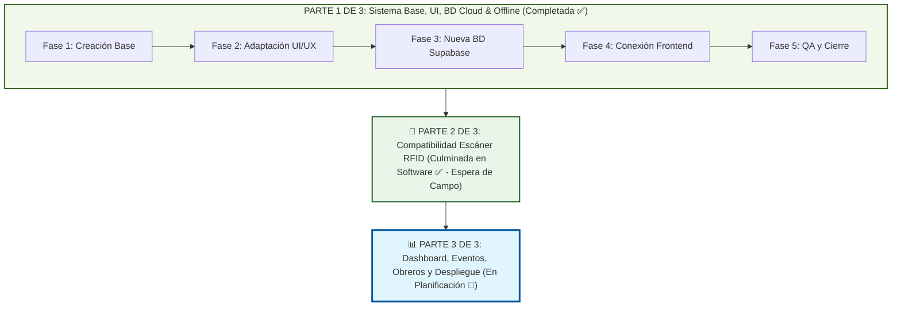

# Planificación General del Proyecto: Gestión Ganadera

Este documento define la hoja de ruta estratégica, el desglose de fases, las decisiones técnicas y el estado de avance para el desarrollo del nuevo sistema **Gestión Ganadera**, tomando como punto de partida y base arquitectónica el sistema **`App-ganadera-v2`**.

---

## 📌 Resumen del Proyecto

- **Nombre del Proyecto**: Gestión Ganadera (`gestion-ganadera`)
- **Base de Origen**: `App-ganadera-v2` (React 19 + Vite 8 + Dexie 4 + Tailwind CSS v4 + Supabase)
- **Paradigma**: Progressive Web App (PWA) Offline-First para campo y zonas rurales sin conectividad
- **Objetivo**: Desarrollar una nueva versión especializada que mantenga la robustez de sincronización y usabilidad offline de la base, adaptando y evolucionando los flujos, pantallas, modelos de datos y características hacia las nuevas especificaciones de negocio.

---

## 🗺️ Mapa de Fases y Macro-Estructura (3 Partes)

---

## 📋 Detalle de Fases y Estado de Avance

### ✅ Fase 1: Creación del Proyecto Base
> **Objetivo**: Duplicar y aislar la base operativa de `App-ganadera-v2` en el nuevo directorio `gestion-ganadera`, asegurando paridad funcional 100%, compilación impecable y conexión provisional a la base de datos existente.

- [x] Estructuración del directorio raíz `C:\Users\joses\appganadera\gestion-ganadera`.
- [x] Copia íntegra de componentes, páginas, utilidades, esquemas y recursos estáticos (`src/`, `public/`).
- [x] Configuración del entorno de dependencias y `node_modules` optimizado para React 19 y Vite 8.
- [x] Actualización de identificadores en `package.json` (`name: "gestion-ganadera"`).
- [x] Configuración de metadatos PWA y manifiesto en `vite.config.js` e `index.html` ("Gestión Ganadera").
- [x] Configuración de variables de entorno `.env.local` con credenciales de Supabase actual para asegurar continuidad durante el desarrollo.
- [x] Verificación de compilación exitosa (`npm run build` ejecutado en 861ms generando Service Worker PWA).
- [x] Creación de `planificacion.md` y `CHANGELOG.md` para control formal del ciclo de vida.
- [x] Vinculación y sincronización con el repositorio remoto de GitHub (`https://github.com/JorgeM11/Gesti-n_Ganadera.git`) en rama `main`.

---

### 🔄 Fase 2: Adaptación Funcional y Rediseño Frontend
> **Objetivo**: Modificar los flujos, formularios, vistas y componentes para remover las características innecesarias y añadir las nuevas funciones requeridas por el usuario.

- [x] **Eliminaciones y Simplificaciones Solicitadas**:
  - [x] **Reproducción**: Removidos los sub-módulos de Tactos (Palpación) y Servicios reproductivos. La pestaña `ReproductionTab.jsx` se simplificó para mostrar exclusivamente Partos/Crías (`PartosTab.jsx`).
  - [x] **Ordeño**: Removido por completo de todo el sistema en interfaz (pestaña en perfil de animal, botones de registro rápido en tarjetas, acceso en drawer de navegación lateral, rutas y modales).
  - [x] **Vacunación por Lotes y Botón Flotante (`+`)**: Removido el modo por lotes y su menú contextual. El botón `+` en `Inventario.jsx` ahora navega directamente a `/inventario/nuevo`.
  - [x] **Formulario Animal (`AnimalForm.jsx`)**: Removido el acordeón de servicio de origen y la consulta de servicios de la madre.
  - [x] **Detalle del Animal (`DetailsTab.jsx`)**: Removida la tarjeta de servicio de origen.
  - [x] **Formulario de Salud (`HealthForm.jsx`)**: Simplificado para registrar tratamientos sanitarios individuales sin lógica de lotes.
  - [x] **Limpieza de Rutas y Archivos Obsoletos**:
    - Eliminadas rutas `/inventario/perfil/servicio`, `/inventario/perfil/tacto` y `/inventario/tratamiento-lote` en `App.jsx`.
    - Eliminados archivos de componentes y páginas huérfanos: `MilkingTab.jsx`, `MilkingModal.jsx`, `TactosTab.jsx`, `ServiciosTab.jsx`, `TactoForm.jsx`, `ServicioForm.jsx`, `PerfilTacto.jsx`, `PerfilServicio.jsx`, `TratamientoLote.jsx`.
- [x] **Nuevas Características Incorporadas**:
  - [x] **Potreros (Segundo nivel de Finca)**:
    - Entidad `potreros` asociada a `farm_id` en IndexedDB ([`db.js`](file:///C:/Users/joses/appganadera/gestion-ganadera/src/lib/db.js) y [`potreroUtils.js`](file:///C:/Users/joses/appganadera/gestion-ganadera/src/lib/potreroUtils.js)).
    - **Modal Independiente de Potreros ([`PotreroModal.jsx`](file:///C:/Users/joses/appganadera/gestion-ganadera/src/components/inventario/PotreroModal.jsx))**: Gestión autónoma idéntica a Fincas y Dueños, con validación estricta y obligatoria de **Nombre del Potrero** y **Finca Asociada**.
    - Integración de acceso a Potreros en la barra lateral ([`NavigationDrawer.jsx`](file:///C:/Users/joses/appganadera/gestion-ganadera/src/components/inventario/NavigationDrawer.jsx)), [`Inventario.jsx`](file:///C:/Users/joses/appganadera/gestion-ganadera/src/pages/Inventario.jsx) y [`AnimalForm.jsx`](file:///C:/Users/joses/appganadera/gestion-ganadera/src/components/inventario/AnimalForm.jsx).
    - Filtro por potrero en [`Inventario.jsx`](file:///C:/Users/joses/appganadera/gestion-ganadera/src/pages/Inventario.jsx) con sub-filtro condicional al seleccionar una finca.
  - [x] **Dueños (Propietarios)**:
    - Entidad `owners` en IndexedDB ([`db.js`](file:///C:/Users/joses/appganadera/gestion-ganadera/src/lib/db.js) y [`ownerUtils.js`](file:///C:/Users/joses/appganadera/gestion-ganadera/src/lib/ownerUtils.js)).
    - Modal de gestión de dueños [`OwnerModal.jsx`](file:///C:/Users/joses/appganadera/gestion-ganadera/src/components/inventario/OwnerModal.jsx) y acceso desde el menú lateral ([`NavigationDrawer.jsx`](file:///C:/Users/joses/appganadera/gestion-ganadera/src/components/inventario/NavigationDrawer.jsx)).
    - Modal de gestión y creación de dueños [`OwnerModal.jsx`](file:///C:/Users/joses/appganadera/gestion-ganadera/src/components/inventario/OwnerModal.jsx) integrado y accesible directamente desde [`AnimalForm.jsx`](file:///C:/Users/joses/appganadera/gestion-ganadera/src/components/inventario/AnimalForm.jsx) con autoselección al guardar, homologado a Finca y Potrero.
    - Búsqueda y visualización por dueño en tarjetas de inventario y detalle del perfil.
  - [x] **Reestructuración de Formulario Animal ([`AnimalForm.jsx`](file:///C:/Users/joses/appganadera/gestion-ganadera/src/components/inventario/AnimalForm.jsx))**:
    - Orden estricto según especificación: 1. Arete, 2. Chip, 3. Nombre, 4. Género, 5. Fecha nacimiento, 6. Peso, 7. Color, 8. Dueño, 9. Finca, 10. Potrero (habilitado al escoger finca), 11. Madre y Padre, 12. Raza sin porcentaje (incluye "Sin raza"), 13. Activo o Inactivo, 14. Foto + Descripción.
    - Desactivación de autocompletado del navegador (`autoComplete="off"`) en los 3 primeros inputs (arete, chip y nombre).
    - Acordeones de eventos de nacimiento y destete removidos por completo.
    - Barra de porcentaje y cálculos genéticos de pureza removidos del formulario.
  - [x] **Ajustes y Correcciones Visuales/Funcionales**:
    - [x] **Escáner Óptico de Código de Barras para Microchip RFID (`BarcodeScannerModal.jsx`, `AnimalForm.jsx`)**: Lector en tiempo real con cámara que autocompleta el número de chip en formularios de registro y edición, con pitido sonoro (Web Audio API), vibración háptica, linterna y selector de cámara.
    - [x] **Apertura de Modal Completo para Dueños (`AnimalForm.jsx`, `OwnerModal.jsx`)**: El botón "Nuevo" abre el modal autónomo de dueños en lugar del input inline, autoseleccionando el dueño creado y cerrando el modal.
    - [x] **Modal de Fincas Exclusivo (`FarmModal.jsx`)**: Removida la sección de potreros de las tarjetas de fincas; el modal ahora es 100% exclusivo para gestionar fincas.
    - [x] **Selector Estilizado en Potreros (`PotreroModal.jsx`)**: Sustituido el selector nativo por el componente reutilizable `CustomSelect` con dropdown flotante y buscador integrado.
    - [x] **Corrección de Difuminado de Botones en Modales Recursivos (`AnimalForm.jsx`, `BottomSheet.jsx`, `NuevoAnimal.jsx`, `PerfilAnimal.jsx`)**: Ajustado el Z-Index de los botones de acción a `z-30` y elevado el telón del modal a `z-70+` con portal al `document.body`, logrando que al registrar padre o madre el fondo y los botones queden totalmente difuminados.
    - [x] **Eliminación Definitiva de Autocompletado de Pago/Tarjetas (`AnimalForm.jsx`)**: Neutralizada la heurística de Google Chrome que detectaba número de arete, chip y nombre como tarjetas bancarias, mediante `Controller`, `autoComplete="one-time-code"` y atributos de formulario especializados.
    - [x] **Botones de Guardar y Cancelar Fijos y Simétricos (`AnimalForm.jsx`, `BottomSheet.jsx`)**: Fijados al borde inferior sin márgenes sobrantes y con tamaño equilibrado 50%/50% (`flex-1`).
    - [x] **Generación de Evento de Nacimiento (`AnimalForm.jsx`)**: Sincronización automática de fecha y peso de nacimiento a la tabla `growth_events` con tipo `'Nacimiento'`.
    - [x] **Botón de Editar Perfil en Vista Móvil (`DetailsTab.jsx`)**: Botón flotante animado (FAB) en la esquina inferior derecha idéntico a `EvolutionTab` y `HealthTab`.
    - [x] **Modales Más Anchos en Laptop (`BottomSheet.jsx`, `NuevoAnimal.jsx`, `PerfilAnimal.jsx`)**: Ancho expandido a `max-w-4xl lg:max-w-5xl` tanto para edición principal como para modales recursivos de Padre y Madre.
    - [x] **Llamado de Atención en Sincronización (`SyncStatus.jsx`)**: Animación de pulso/respiración (crece y se disminuye) cuando hay pendientes de sincronizar.
    - [x] **Icono de Vaca en Menú Lateral (`NavigationDrawer.jsx`)**: Sustituido el escudo por la silueta de vaca (`GiCow`).
    - [x] **Eliminación Restringida**: Eliminada la opción de borrado para Dueños, Potreros y Fincas.
    - [x] **Cards de Animales en 2 Columnas para Móvil (`Inventario.jsx`)**: Cuadrícula `grid-cols-2` fija en teléfonos móviles con diseño y tipografía optimizados.
  - [x] **Filtros Avanzados y Búsqueda en Inventario ([`Inventario.jsx`](file:///C:/Users/joses/appganadera/gestion-ganadera/src/pages/Inventario.jsx))**:
    - [x] **Filtro Contextual por Potrero**: En el drawer de filtros, la sección de potreros se activa dinámicamente tras seleccionar una finca, mostrando el conteo de animales por potrero. Si no hay finca elegida, guía al usuario a seleccionar una con un icono SVG `Info` (sin emojis).
    - [x] **Filtro por Dueño**: Sección dedicada en el drawer de filtros que permite filtrar animales por propietario específico, sin dueño asignado o todos.
    - [x] **Búsqueda por Chip Electrónico**: Barra de búsqueda optimizada para consultar por chip (`chip_number`), arete (`number`), nombre (`name`) y dueño (`owner`), normalizando caracteres y espacios.
    - [x] **Banner Interactivo de Filtros Activos**: Tags removibles visibles arriba de la lista para remover filtros individuales (Finca, Potrero, Dueño, Sexo, Estado, etc.) o limpiar todos con un clic.
  - [x] **Actualización de Ficha Técnica ([`DetailsTab.jsx`](file:///C:/Users/joses/appganadera/gestion-ganadera/src/components/DetailsTab.jsx)) e Inventario ([`Inventario.jsx`](file:///C:/Users/joses/appganadera/gestion-ganadera/src/pages/Inventario.jsx))**:
    - Visualización limpia de arete, chip, nombre, dueño, finca, potrero, raza sin porcentaje y estado.

---

### ✅ Fase 3: Diseño y Despliegue de Nueva BD en Supabase
> **Objetivo**: Crear y aprovisionar un nuevo proyecto/esquema en Supabase que tome como base la estructura original y añada todas las tablas, columnas, restricciones e índices demandados por el nuevo frontend.

- [x] Creación del nuevo proyecto en Supabase Cloud (`mdyycsydocenrauzvalu`).
- [x] Extracción y análisis del DDL de la base de datos anterior.
- [x] Modificación y creación de scripts SQL de migración (nuevas tablas `potreros`, `owners`, campos `chip_number`, `name`, `admin_id` para futuros obreros, llaves foráneas).
- [x] Configuración de buckets de almacenamiento para fotos (`ganadera_images`, público con 4 políticas RLS).
- [x] Políticas de seguridad Row Level Security (RLS) y roles de usuario.
- [x] Actualización del esquema local Dexie (`src/lib/db.js`) para alinear versiones y migraciones.

---

### ✅ Fase 4: Conexión Frontend con la Nueva BD
> **Objetivo**: Enlazar la aplicación con la nueva instancia de Supabase y validar la comunicación de ida y vuelta.

- [x] Actualización de variables de entorno `.env.local` con las nuevas URL y Anon Key del nuevo proyecto.
- [x] Ajustes en `supabaseClient.js`, `syncUtils.js` y `authService.js` según nuevos esquemas.
- [x] Validación de la cola de sincronización (`sync_queue`) con los nuevos endpoints y tablas (`potreros`, `owners`).
- [x] Pruebas de autenticación y seed del primer administrador en la nueva BD (`admin@campo.com`).
- [x] Pruebas de integración E2E automatizadas (inserción, lectura relacional con joins y limpieza de fincas, potreros, dueños y animales con chip).

---

### ✅ Fase 5: Pruebas Exhaustivas, Aseguramiento de Calidad y Cierre
> **Objetivo**: Certificar la estabilidad, rendimiento y resiliencia del sistema bajo condiciones extremas de campo y múltiples administradores.

- [x] Pruebas de funcionamiento Offline estricto y estabilización del botón de sincronización (sin titilado ni alerta amarilla cuando se está offline con cambios pendientes).
- [x] Pruebas de sincronización bidireccional y aislamiento estricto multi-usuario (usuarios independientes administradores de su propio rebaño: `juannatera@gmail.com`, `carlosmendoza@gmail.com`).
- [x] Optimización de identidad gráfica: icono de la app actualizado con la vaca blanca en todas las resoluciones (Android, iOS, PWA, favicon ICO, SVG).
- [x] Configuración técnica y semántica de SEO integral (OpenGraph, Twitter Cards, Schema.org JSON-LD, `robots.txt`, `sitemap.xml`).
- [x] Ajustes finales de interfaz y catálogo: orden de razas con Mestizo de primero seguido de razas blancas, icono de vaca en contadores de finca, potrero y dueño, y etiqueta limpia de respaldo.
- [x] Verificación de compilación en Vite 8 en menos de 1 segundo con 0 advertencias de código.
- [x] Cierre y entrega formal de la **Parte 1 de 3** con repositorio de GitHub al día.

---

### ✅ Parte 2 de 3: Adaptación del Sistema y Compatibilidad con Escáner RFID (Culminada en Software - En Espera de Observaciones de Campo)
> **Objetivo**: Integrar la aplicación web progresiva (PWA) directamente con el dispositivo escáner / lector físico de microchips y aretes RFID (bastón o lector ganadero inalámbrico), garantizando la captura fluida, identificación instantánea y gestión sin pérdida de datos en campo.

- [x] **Aprobación del Cliente**: Presentación y validación exitosa de la Parte 1 por parte del cliente.
- [x] **Compatibilidad Universal de Enlace (Frontend & Modo Cuña de Teclado)**:
  - Soporte universal para lectores ganaderos inalámbricos y por cable emulando teclado (Bluetooth HID en modo cuña de teclado y USB-OTG).
  - Verificación de compatibilidad con navegadores móviles y entorno PWA instalable en smartphones (Android / iOS).
- [x] **Modificación y Adaptación del Software (Frontend & UX)**:
  - [x] **Buffer Resiliente contra Jitter en Escaneo Físico**: Ventana de acumulación de 200 ms y supresión de re-renders intermedios en `Inventario.jsx` y `AnimalForm.jsx` para evitar pérdida o truncamiento de dígitos de 15 cifras (ISO 11784/11785).
  - [x] **Soporte de Escáner y Borrado Rápido en Entradas de Identificación**: Soporte de escáner físico, sanitización de pegado y botones de borrado rápido (`X`) en número de arete y chip.
  - [x] **Búsqueda Instantánea en Inventario**: Asignación atómica del código escaneado con feedback informativo Toast y filtrado reactivo del animal.
  - [x] **Formularios de Registro y Edición (`AnimalForm.jsx`)**: Autocompletado del chip RFID en tiempo real con validación inmediata de duplicidad (bloqueando la asignación si el chip ya existe).
  - [x] **Respaldo sin Tecla Enter**: Temporizador autónomo de 120 ms para lectores que no envían caracter de retorno de carro.
- [x] **Cierre de Fase y Pausa de Hardware**: Desarrollo y blindaje de software 100% finalizado. Pruebas de campo finales con el bastón físico y calibración en manga en espera de observaciones y recepción del dispositivo por parte del cliente.

---

### 🚀 Parte 3 de 3: Dashboard Ejecutivo, Eventos en Inventario, Módulo de Obreros y Despliegue (En Progreso / Planificación)
> **Objetivo**: Desarrollar la pantalla principal de Dashboard con analíticas y KPIs globales del rebaño, incorporar la sección de Eventos en Inventario para consulta y auditoría cronológica, construir el sistema de gestión de obreros/asistentes con roles y permisos acotados, y ejecutar el despliegue final en producción.

- [ ] **1. Dashboard Central Ganadero (Métricas & KPIs en Vivo)**:
  - Vista general ejecutiva del rebaño con carga offline instantánea vía IndexedDB (Dexie).
  - Tarjetas de resumen métrico: total de animales, distribución por sexo (machos/hembras), desglose por categorías ganaderas (becerros, mautes, novillas, adultos) y estado (activos/inactivos).
  - Indicadores de peso promedio del rebaño y comparativas de ganancia de peso.
  - Resumen de actividades recientes: nacimientos del mes, tratamientos sanitarios aplicados y alertas de animales pendientes por pesar o revisar.
  - Accesos rápidos hacia Inventario, Eventos, Fincas y Registro de Animal.
  - Enlace al Dashboard en la barra de navegación lateral (`NavigationDrawer.jsx`) y ruta `/dashboard`.
- [ ] **2. Apartado de Eventos en Inventario (Historial & Trazabilidad)**:
  - Vista o pestaña especializada en Inventario dedicada a la consulta y seguimiento de eventos (`growth_events`, nacimientos, destetes, pesajes y cambios de estatus).
  - Línea de tiempo cronológica con filtros por rango de fecha, tipo de evento, finca, potrero y animal específico.
  - Trazabilidad y auditoría: visualización de qué usuario (administrador u obrero) registró el evento, fecha exacta de captura y detalles asociados.
- [ ] **3. Modelo de Datos y Permisos de Obreros (Supabase & Dexie)**:
  - Estructura relacional con campo `admin_id` en tablas maestras (ya aprovisionada en Supabase y Dexie).
  - Asignación de roles de usuario (`Administrador` vs `Obrero/Encargado`).
  - Restricciones de acceso y Row Level Security (RLS) para que el obrero solo acceda a los animales y fincas asignados por su administrador.
- [ ] **4. Módulo de Gestión de Obreros en Frontend**:
  - Panel administrativo para dar de alta obreros, asignar fincas y gestionar credenciales/estados.
  - Adaptación de la navegación lateral según el rol del usuario autenticado (ocultando gestión sensible a obreros).
- [ ] **5. Flujo Operativo de Campo para Obreros**:
  - Permisos estrictos: captura de pesajes, registro de tratamientos sanitarios y reporte de partos, sin permisos de borrado de fincas ni configuración global.
  - Registro de auditoría de creador/modificador en eventos.
- [ ] **6. QA Final, Sincronización Concurrente y Despliegue en Producción**:
  - Pruebas de sincronización offline-online concurrente entre Administrador y Obrero.
  - Puesta a punto de PWA y Service Worker para producción.
  - Despliegue definitivo en hosting cloud (Vercel / Supabase).

---

## 📈 Bitácora de Estado Actual

| Hito | Fecha | Estado | Responsable | Observaciones |
| :--- | :---: | :---: | :---: | :--- |
| **Puesta en marcha Fase 1** | 2026-10-02 | **Completado** | Antigravity AI | Proyecto `gestion-ganadera` creado y compilando al 100% sobre la base de `App-ganadera-v2`. |
| **Fase 2: Eliminaciones solicitadas** | 2026-10-02 | **Completado** | Antigravity AI | Retirado ordeño, tactos, servicios reproductivos, modo lotes en vacunación y botón `+` directo. Compilación verificada con éxito. |
| **Fase 2: Nuevas funcionalidades frontend** | 2026-10-03 | **Completado** | Antigravity AI & Usuario | Potreros por Finca en modal propio, Dueños en modal propio, orden en AnimalForm (Raza tras características biológicas), escáner de código de barras integrado en chip y buscador de inventario. |
| **Fase 3: Nueva BD Supabase** | 2026-10-04 | **Completado** | Antigravity AI & Usuario | Proyecto `mdyycsydocenrauzvalu` aprovisionado, tablas `potreros`, `owners`, `animals` con chip, estructura para obreros, RLS y bucket `ganadera_images`. |
| **Fase 4: Conexión Frontend con Nueva BD** | 2026-10-04 | **Completado** | Antigravity AI | `.env.local` actualizado, `syncUtils.js` sincronizando `potreros` y `owners`. Tests E2E de inserción, lectura relacional y storage superados al 100%. |
| **Fase 5: QA, SEO, Branding y Cierre (Parte 1)** | 2026-10-06 | **Completado** | Antigravity AI & Usuario | Vaca blanca en iconos, SEO completo, orden de razas, multi-usuario probado, offline refinado y sincronización con GitHub completada al 100%. |
| **Parte 1: Refinamientos Finales** | 2026-10-06 | **Completado** | Antigravity AI & Usuario | Arete y chip alternativos esenciales, chip único con alerta reactiva y bloqueo, sección raza bajo ubicación y filtros por edad ganadera (becerros, mautes, novillas, adultos). |
| **Parte 2: Cierre de Software Escáner RFID** | 2026-10-07 | **Completado** | Antigravity AI & Usuario | Software 100% adaptado con buffer de 200ms anti-jitter, protección contra pérdida de dígitos, borrado rápido y búsqueda instantánea. Culminada a espera de observaciones de campo. |
| **Parte 3 de 3: Dashboard, Eventos, Obreros y Despliegue** | 2026-10-07 | **En progreso** | Antigravity AI & Usuario | Incorporados formalmente a la Parte 3: Dashboard central ganadero, apartado de eventos en inventario, módulo de obreros y despliegue a producción. |

